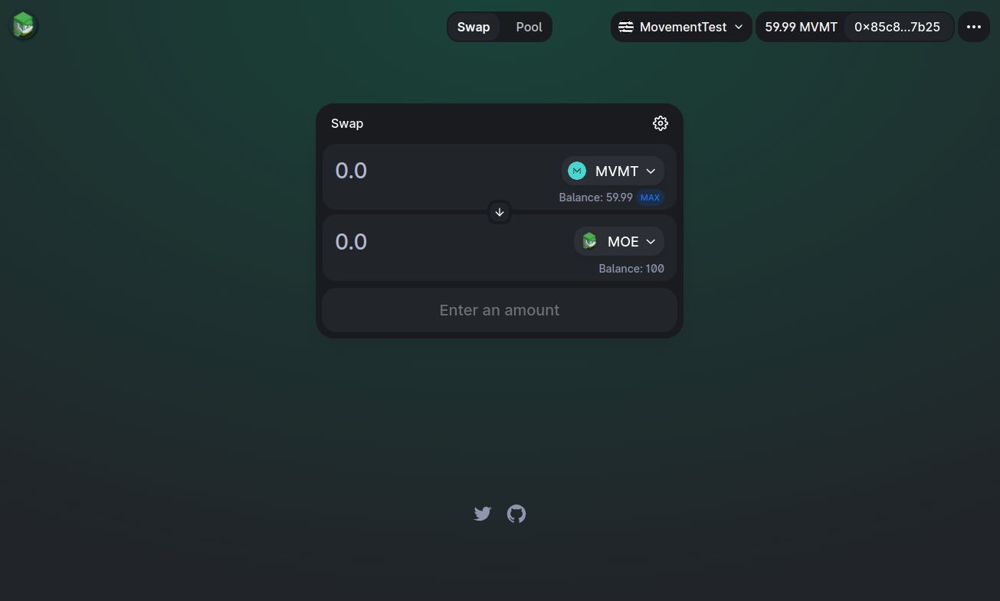
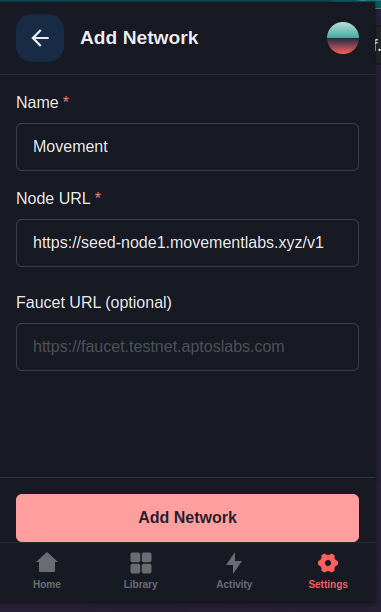

**Disclaimer:** The original TraderMoe can be found here: https://github.com/AshAvalanche/TraderMoe. This repo is only intended for educational purposes. 

**Note:** Use the demo branch to engage with a more user-friendly deployment process if you would like to use your own keys.

# Trader Mo(v)e


> Trader Moe is [Trader Joe](https://traderjoexyz.com)'s strange cousin from the west. He lives in the [Movement Network](https://docs.movementlabs.xyz/)'s [Subnet](https://subnets-test.avax.network/subnets/K4GygGTpKkNzzjiLfZVsmQduGqSFztJx4nk52CvA1afcFAhsH) powered by [Avalanche](https://www.avax.network/).

**Trader Moe** is a **DEX/AMM protocol** for the **Move Protocol** built by the [Ash](https://ash.center/) team for the [Avalanche Hackathon 2023 (HK)](https://www.talentre.academy/hackathon/avalanche-hackathon).

**Note:** The frontend is a fork of [Uniswap](https://github.com/Uniswap/interface) and the Move modules are forked from [Pontem Network/Liquidswap](https://github.com/pontem-network) and [AnimeSwap/v1-core](https://github.com/AnimeSwap/v1-core).

## Interface



The interface is available at [https://tradermoe.xyz](https://tradermoe.xyz/#/swap?chain=movement_testnet).

🚨⚠️ **Warning:** Please use the [Petra](https://petra.app/) wallet as the [Pontem](https://pontem.network/) wallet seems to be unstable with the interface. ⚠️🚨

## Network

You should add the [Movement Network](https://docs.movementlabs.xyz/)'s [Testnet](https://subnets-test.avax.network/subnets/K4GygGTpKkNzzjiLfZVsmQduGqSFztJx4nk52CvA1afcFAhsH) to the wallet, see [How to add the Movement network to my wallet?](https://docs.movementlabs.xyz/testnet/how-to-add-the-movement-network-to-my-wallet) for details. Here's what it looks like in Petra:



Modules addresses:
- `0x2e2f2175ecc96dfc48dbd789da52455344513e98c0641a737637fe83dc0b6d7c::moe_coin`
- `0x2e2f2175ecc96dfc48dbd789da52455344513e98c0641a737637fe83dc0b6d7c::TraderMoePoolV1`
- `0x2e2f2175ecc96dfc48dbd789da52455344513e98c0641a737637fe83dc0b6d7c::TestCoinsV1`

## Test account

Feel free to use the following test account which has been provisioned with $MVMT, $MOE, $USDT and $BTC:

```
private_key: "0xe6d5baf4f2b848e14ee030cea09c3be20eee3055fc94b19ce1c58b3898a52113"
public_key: "0x3ba26879a4d67d601b70ec80affe0449840a39e4a1e161281dcb5d195181e996"
account: "85c89b911b2d4bade71296f6ac68f97ca73b151d608a4c8c2635f52739687b25"
```

You can import the private key above in the Petra Wallet to interact with TraderMoe.

## Development

### Prerequisites

- [Movement CLI](https://docs.movementlabs.xyz/developers/developer-tools/movement-cli)
- Node >= 18

```bash
git clone https://github.com/AshAvalanche/tradermoe
```

### Trader Mo(v)e modules

See [modules/README.md](./modules/README.md)

### Trader Mo(v)e frontend

See [interface/README.md](./interface/README.md)
